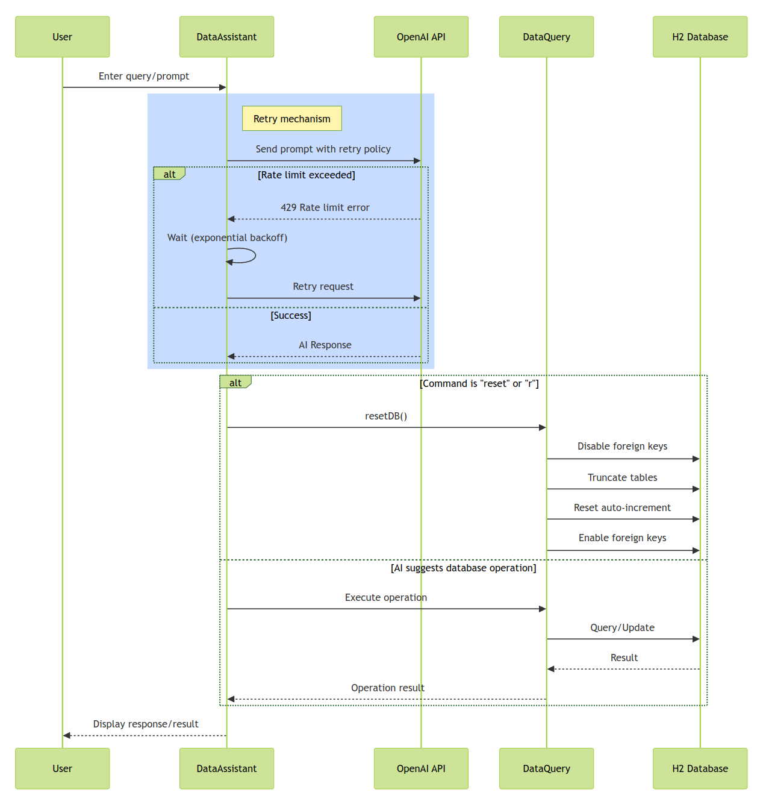

# ag25-ai-assistant

This repo is my frok from the [mwinteringham/ag25-ai-assistant](https://github.com/mwinteringham/ag25-ai-assistant). I use this repo to learn and practice experiments about Ai Agents in JAVA. 

## How this demo Ai Agent works:

<p align="center">
    
</p>

This diagram illustrates the core workflow of the AI Assistant:

Flow Example:

1. User Query: User asks "Create a single room with 1 bed for $100 per night"

2. AI Processing:
    - OpenAI processes the natural language request
    - Identifies the intent to create a room
    - Extracts relevant parameters (type=single, beds=1, price=100)

3. Tool Execution:
    - AI calls the appropriate tool method: `createRoom("Single", 1, "A single room with one bed", 100)`
    - The tool method interacts with the database through DataQuery

4. Response: The operation result is returned to the user.


## Added features:

* DevContainer setup on docker compose dev environment
    * Added `.devcontainer` configuration for VS Code
    * Includes Docker Compose setup for local development
    * Pre-configured Git and development tools
    * Ensures a reproduceble and consistent development environment

* Reset DB before each unit test
    * Implemented `@BeforeEach` step for the `DataQueryTest` test suite.
    * Added database reset logic
    * Ensures test isolation and prevents data interference
    * Tests can run in any order reliably

* Added LogBack as the log4j provider
    * Configured `logback.xml` for structured logging
    * Set up a default console logger for the code in this project.
    * Improved log formatting and readability
    
* **Added Retries logic with resilience4j**
    * Added retry mechanisms to recover from rate limiting errors
    * Configured fallback strategies

* Expanded the AI tools.
    * Added a show rooms functions
    * Added a show bookings functions
    * These extra tools allow testing the behaviour of the LLM for close semantic requests.
    

## How to Run the Project

### Prerequisites
- Visual Studio Code or IntelliJ IDEA
- Docker Desktop installed and running
- Git client

### Setup Steps

1. Clone the repository:
    ```bash
    git clone https://github.com/marcandreuf/ag25-ai-assistant.git
    cd ag25-ai-assistant
    ```

2. Configure OpenAI API Key:
    ```bash
    cp docker/.env.dist docker/.env
    ```
    Edit `docker/.env` and add your OpenAI API key:
    ```
    OPENAI_API_KEY=your-api-key-here
    ```

3. Open in Development Environment:
    - **VS Code:**
      - Install the Dev Containers extension, code: "ms-vscode-remote.remote-containers".
      - Open the project folder
      - Click `Dev Containers: Reopen in Container` when prompted
    - **IntelliJ IDEA:**
      - Open the project
      - Select "Open in Dev Container" if prompted

4. Navigate to Main Class:
    - Locate `com.mwtestconsultancy.DataAssistant` in the project explorer
    - This is the main entry point of the application

5. Run the Application:
    - In VS Code: Click the "Run" icon (▶️) in the top right
    - In IntelliJ: Click the green "Run" arrow next to the main method

6. Interact with the LLM:
    Once the application is running, you can enter commands in the terminal:

    Example commands:
    - `List the rooms`
    - `Create 2 rooms with 2 beds`
    - `Create a booking`
    - `Show all bookings`
    - `Delete a booking`

7. Exit the app, type `q` or `exit`


### Troubleshooting

1. For specific issues:
    - Open an issue in the GitHub repository
    - Include error messages and steps to reproduce
    - Add relevant environment details

